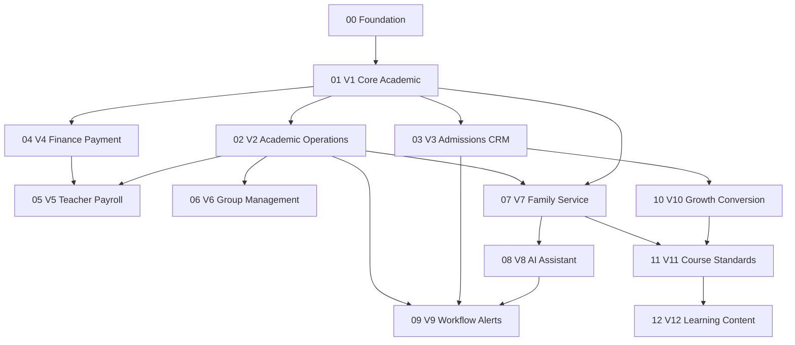

# MineAdmin Education SaaS Master Implementation Plan

> **For agentic workers:** REQUIRED SUB-SKILL: Use superpowers:subagent-driven-development (recommended) or superpowers:executing-plans to implement this plan task-by-task. Steps use checkbox (`- [ ]`) syntax for tracking.

**Goal:** Turn the V1-V12 MineAdmin Education SaaS design specs into an ordered implementation roadmap with clear plan boundaries, dependencies, verification gates, and follow-up detailed plan files.

**Architecture:** The product should be implemented as a MineAdmin / Hyperf modular SaaS backend with PC admin panels and uni-app mobile clients for teacher, guardian, and operator workflows. Implementation must proceed in independent, testable milestones: tenant foundation first, then core education workflows, then finance, payroll, group management, family service, AI, workflow, growth, course standards, and learning content.

**Tech Stack:** MineAdmin, Hyperf, PHP 8.3+, MySQL 8, Redis, uni-app, WeChat service account / mini program, object storage, queue workers, PHPUnit/Pest-compatible backend tests, frontend/mobile API contract tests.

---

## Scope Check

The current design set covers twelve major product versions:

- V1: 课消制培训机构 MVP。
- V2: 教务运营增强。
- V3: 招生 CRM 与试听转化。
- V4: 收款支付与财务对账。
- V5: 教师薪酬与绩效结算。
- V6: 企业增强与多校区集团管理。
- V7: 家校服务与学习反馈。
- V8: AI 教务助手与智能分析。
- V9: 智能运营预警与自动化工作流。
- V10: 招生增长与顾问智能转化。
- V11: 课程教研与服务标准化。
- V12: 轻量学习内容中心。

These specs are too broad for one coding plan. This master plan is **Plan 0: roadmap and sequencing**. Each implementation wave below must get its own detailed plan before code work starts.

## Source Specs

Implementation must use these specs as the authoritative product requirements:

```text
docs/superpowers/specs/2026-06-09-mineadmin-education-saas-v1-design.md
docs/superpowers/specs/2026-06-09-mineadmin-education-saas-v2-design.md
docs/superpowers/specs/2026-06-09-mineadmin-education-saas-v3-design.md
docs/superpowers/specs/2026-06-09-mineadmin-education-saas-v4-design.md
docs/superpowers/specs/2026-06-09-mineadmin-education-saas-v5-design.md
docs/superpowers/specs/2026-06-09-mineadmin-education-saas-v6-design.md
docs/superpowers/specs/2026-06-09-mineadmin-education-saas-v7-design.md
docs/superpowers/specs/2026-06-09-mineadmin-education-saas-v8-design.md
docs/superpowers/specs/2026-06-09-mineadmin-education-saas-v9-design.md
docs/superpowers/specs/2026-06-10-mineadmin-education-saas-v10-design.md
docs/superpowers/specs/2026-06-10-mineadmin-education-saas-v11-design.md
docs/superpowers/specs/2026-06-10-mineadmin-education-saas-v12-design.md
```

## Plan File Structure

Create one detailed plan per implementation wave:

```text
docs/superpowers/plans/
├── 2026-06-10-mineadmin-education-saas-strict-plan-standard.md
├── 2026-06-10-mineadmin-education-saas-master-plan.md
├── 2026-06-10-mineadmin-education-saas-detailed-plan-backlog.md
├── 2026-06-10-mineadmin-education-saas-00-foundation.md
├── 2026-06-10-mineadmin-education-saas-00-f00-environment.md
├── 2026-06-10-mineadmin-education-saas-00-f01-tenant-campus.md
├── 2026-06-10-mineadmin-education-saas-00-f02-user-profile-role-scope.md
├── 2026-06-10-mineadmin-education-saas-00-f03-dictionary-feature-flag.md
├── 2026-06-10-mineadmin-education-saas-00-f04-audit-log.md
├── 2026-06-10-mineadmin-education-saas-00-f05-pc-admin-foundation.md
├── 2026-06-10-mineadmin-education-saas-00-f06-mobile-foundation.md
├── 2026-06-10-mineadmin-education-saas-01-v1-core-academic.md
├── 2026-06-10-mineadmin-education-saas-01-v1-01-profile-records.md
├── 2026-06-10-mineadmin-education-saas-01-v1-02-course-package-account.md
├── 2026-06-10-mineadmin-education-saas-01-v1-03-class-schedule-lesson.md
├── 2026-06-10-mineadmin-education-saas-01-v1-04-attendance-consumption-adjustment.md
├── 2026-06-10-mineadmin-education-saas-01-v1-05-leave-makeup-reschedule.md
├── 2026-06-10-mineadmin-education-saas-01-v1-06-teacher-mobile.md
├── 2026-06-10-mineadmin-education-saas-01-v1-07-guardian-mobile.md
├── 2026-06-10-mineadmin-education-saas-01-v1-08-reports-acceptance.md
├── 2026-06-10-mineadmin-education-saas-02-v2-academic-operations.md
├── 2026-06-10-mineadmin-education-saas-03-v3-admissions-crm.md
├── 2026-06-10-mineadmin-education-saas-04-v4-finance-payment.md
├── 2026-06-10-mineadmin-education-saas-05-v5-teacher-payroll.md
├── 2026-06-10-mineadmin-education-saas-06-v6-group-management.md
├── 2026-06-10-mineadmin-education-saas-07-v7-family-service.md
├── 2026-06-10-mineadmin-education-saas-08-v8-ai-assistant.md
├── 2026-06-10-mineadmin-education-saas-09-v9-workflow-alerts.md
├── 2026-06-10-mineadmin-education-saas-10-v10-growth-conversion.md
├── 2026-06-10-mineadmin-education-saas-11-v11-course-standards.md
└── 2026-06-10-mineadmin-education-saas-12-v12-learning-content.md
```

## Strict Detailed Plan Gate

Each implementation wave must satisfy `docs/superpowers/plans/2026-06-10-mineadmin-education-saas-strict-plan-standard.md` before its status can be changed to `ready`.

A detailed plan must include:

- each module's exact create/modify/test file paths
- full database migration design with columns, indexes, tenant/campus fields, and rollback
- API method, path, permission, request JSON, success response JSON, validation failure, and business failure
- MineAdmin backend layering: Controller, Request, Service, Repository, Model, Schema or route registration, tests
- MineAdmin PC frontend tasks: route, menu permission, API client, list/search/form/action pages
- teacher and guardian uni-app tasks: page path, API client, role isolation, loading/empty/error states
- concrete backend/frontend/mobile test cases
- execution commands and expected acceptance output

If any of these are missing, the plan status is `drafting`, not `ready`.

## Target Project Structure

The detailed implementation plans should converge on this project structure:

```text
mineadmin-education-saas/
├── backend/
│   ├── app/
│   │   ├── Http/
│   │   │   ├── Admin/
│   │   │   │   ├── Controller/Education/
│   │   │   │   ├── Request/Education/
│   │   │   │   └── Middleware/Education/
│   │   │   └── Api/
│   │   │       ├── Controller/Education/
│   │   │       ├── Request/Education/
│   │   │       └── Middleware/Education/
│   │   ├── Contract/Education/
│   │   ├── Event/Education/
│   │   ├── Listener/Education/
│   │   ├── Service/Education/
│   │   ├── Repository/Education/
│   │   ├── Model/Education/
│   │   ├── Schema/Education/
│   │   └── Model/Enums/Education/
│   ├── databases/
│   │   ├── migrations/
│   │   └── seeders/
│   ├── tests/
│   │   ├── Feature/
│   │   └── Unit/
│   └── docs/
├── admin-web/
│   └── src/views/education/
├── mobile-uniapp/
│   ├── pages/teacher/
│   ├── pages/guardian/
│   └── pages/operator/
└── deployments/
```

Detailed plans may adapt class names and base classes to the generated MineAdmin version after the repository is initialized, but they must keep MineAdmin's native layer boundaries. Do not introduce a parallel `app/Education` application tree unless the generated MineAdmin version explicitly recommends that pattern.

## Dependency Order

Implementation order:



## Task 1: Create Foundation Detailed Plan

**Files:**

- Read: `docs/superpowers/specs/2026-06-09-mineadmin-education-saas-v1-design.md`
- Create: `docs/superpowers/plans/2026-06-10-mineadmin-education-saas-00-foundation.md`

- [ ] **Step 1: Define the foundation scope**

The foundation plan must include:

```text
- MineAdmin / Hyperf project initialization.
- Local Docker services for MySQL and Redis.
- Environment configuration.
- Tenant, campus, role, permission, user, and audit-log foundation.
- Shared dictionary/status enums for education modules.
- Base migration and seeding strategy.
- Backend feature test bootstrap.
- Admin-web route/menu bootstrap.
- uni-app environment bootstrap.
```

- [ ] **Step 2: Exclude business workflows from the foundation**

The foundation plan must explicitly exclude:

```text
- Student enrollment.
- Course account and lesson consumption.
- Scheduling.
- Admissions CRM.
- Payment and finance.
- Teacher payroll.
- AI.
- Workflow automation.
- Family service.
```

- [ ] **Step 3: Define the foundation acceptance gate**

The detailed plan must require these checks:

```bash
php bin/hyperf.php migrate
php bin/hyperf.php db:seed --class=EducationFoundationSeeder
composer test
pnpm lint
pnpm test
```

Expected result:

```text
All migrations run successfully.
Seeded tenant, campus, roles, permissions, and demo users are available.
Backend tests pass.
Frontend lint and tests pass.
```

## Task 2: Create V1 Core Academic Detailed Plan

**Files:**

- Read: `docs/superpowers/specs/2026-06-09-mineadmin-education-saas-v1-design.md`
- Create: `docs/superpowers/plans/2026-06-10-mineadmin-education-saas-01-v1-core-academic.md`

- [ ] **Step 1: Cover V1 MVP domains**

The detailed plan must implement:

```text
- Students.
- Guardians.
- Student-guardian binding.
- Teachers.
- Courses.
- Classes.
- Class students.
- Enrollments.
- Lesson packages.
- Course accounts.
- Lessons.
- Attendance.
- Lesson consumption.
- Notices.
- PC admin APIs and views.
- Teacher mobile APIs.
- Guardian mobile APIs.
```

- [ ] **Step 2: Define V1 critical transaction boundaries**

The detailed plan must require database transactions for:

```text
- Enrollment creation as a pending record, with account materialization deferred to confirmation per the Enrollment Activation Timing Contract.
- Attendance submission with lesson consumption.
- Lesson cancellation with no consumption.
- Course account balance adjustment through approved service methods only.
```

The V1-02 detailed plan owns the Enrollment Activation Timing Contract: enrollment create produces a pending record; confirmation materializes account units exactly once and is idempotent on enrollment id; a per-tenant F03 feature flag selects direct mode (create confirms inline) or gated mode (V4 payment success confirms). V4 consumes this contract and must not redefine it.

- [ ] **Step 3: Define V1 acceptance gate**

The V1 detailed plan must pass:

```text
- Admin can create student, guardian, course, class, and teacher.
- Admin can enroll a student into a course package.
- Teacher can view today's lessons.
- Teacher can submit attendance.
- Present attendance consumes lesson balance exactly once.
- Guardian can view remaining lessons and consumption records.
- Tenant isolation blocks cross-tenant reads and writes.
```

## Task 3: Create V2 Academic Operations Detailed Plan

**Files:**

- Read: `docs/superpowers/specs/2026-06-09-mineadmin-education-saas-v2-design.md`
- Create: `docs/superpowers/plans/2026-06-10-mineadmin-education-saas-02-v2-academic-operations.md`

- [ ] **Step 1: Cover V2 operational domains**

The detailed plan must implement:

```text
- Lesson change records.
- Leave requests.
- Make-up lessons.
- Consumption review.
- Consumption reversal.
- Renewal alerts.
- Teacher workload metrics.
- Academic operations dashboard.
```

- [ ] **Step 2: Define V2 risk controls**

The detailed plan must require:

```text
- Consumption reversal never physically deletes the original consumption record.
- Leave approval cannot create duplicate make-up entitlement.
- Make-up lesson attendance cannot consume the original package twice.
- Renewal alerts are advisory and do not create orders.
```

## Task 4: Create V3 Admissions CRM Detailed Plan

**Files:**

- Read: `docs/superpowers/specs/2026-06-09-mineadmin-education-saas-v3-design.md`
- Create: `docs/superpowers/plans/2026-06-10-mineadmin-education-saas-03-v3-admissions-crm.md`

- [ ] **Step 1: Cover V3 admissions domains**

The detailed plan must implement:

```text
- Admission leads.
- Lead contacts.
- Lead students.
- Lead assignment.
- Follow-up records.
- Trial lessons.
- Trial feedback.
- Lead conversion to formal enrollment.
- Admission channels.
- Admission tasks.
- Admission dashboard.
```

- [ ] **Step 2: Define V3 transaction boundary**

Lead conversion must be a single transaction:

```text
lead -> guardian -> student -> enrollment -> course_account -> conversion_record -> lead_status
```

If any step fails, the conversion must roll back.

## Task 5: Create V4 Finance Payment Detailed Plan

**Files:**

- Read: `docs/superpowers/specs/2026-06-09-mineadmin-education-saas-v4-design.md`
- Create: `docs/superpowers/plans/2026-06-10-mineadmin-education-saas-04-v4-finance-payment.md`

- [ ] **Step 1: Cover V4 finance domains**

The detailed plan must implement:

```text
- Finance orders.
- Payment records.
- Offline payment confirmation.
- WeChat payment integration boundary.
- Refund applications.
- Refund approvals.
- Receipt records.
- Reconciliation records.
- Finance dashboard.
```

- [ ] **Step 2: Define V4 safety rules**

The detailed plan must require:

```text
- Payment callbacks are idempotent.
- Refund approval never directly deletes payment records.
- Finance records are tenant-isolated.
- Financial amount fields use integer cents or decimal with fixed precision.
```

## Task 6: Create V5 Teacher Payroll Detailed Plan

**Files:**

- Read: `docs/superpowers/specs/2026-06-09-mineadmin-education-saas-v5-design.md`
- Create: `docs/superpowers/plans/2026-06-10-mineadmin-education-saas-05-v5-teacher-payroll.md`

- [ ] **Step 1: Cover V5 payroll domains**

The detailed plan must implement:

```text
- Salary rules.
- Salary rule matching.
- Salary batches.
- Salary slips.
- Salary items.
- Review workflow.
- Payment marking.
- Teacher dispute records.
- Teacher performance metrics.
```

- [ ] **Step 2: Define V5 calculation controls**

The detailed plan must require:

```text
- Salary batch generation snapshots source data.
- Rebuilding a draft batch is allowed.
- Approved salary batches cannot be silently recalculated.
- Payroll does not modify lesson consumption.
```

## Task 7: Create V6 Group Management Detailed Plan

**Files:**

- Read: `docs/superpowers/specs/2026-06-09-mineadmin-education-saas-v6-design.md`
- Create: `docs/superpowers/plans/2026-06-10-mineadmin-education-saas-06-v6-group-management.md`

- [ ] **Step 1: Cover V6 enterprise domains**

The detailed plan must implement:

```text
- Organization units.
- Campus hierarchy.
- Cross-campus data permissions.
- Lightweight approvals.
- Contracts.
- Group metrics.
- Franchise reservation fields.
- Risk audit logs.
```

- [ ] **Step 2: Define V6 permission gate**

The detailed plan must require tests for:

```text
- Campus admin sees only own campus.
- Group admin sees authorized campus set.
- Teacher does not gain cross-campus access from group metrics.
- Contract access respects tenant and campus permissions.
```

## Task 8: Create V7 Family Service Detailed Plan

**Files:**

- Read: `docs/superpowers/specs/2026-06-09-mineadmin-education-saas-v7-design.md`
- Create: `docs/superpowers/plans/2026-06-10-mineadmin-education-saas-07-v7-family-service.md`

- [ ] **Step 1: Cover V7 family service domains**

The detailed plan must implement:

```text
- Lesson comments.
- Comment templates.
- Performance tags.
- Homework assignments.
- Homework submissions.
- Homework reviews.
- Growth records.
- Learning reports.
- Family messages.
- Read receipts.
- Service quality metrics.
```

- [ ] **Step 2: Define V7 publication rules**

The detailed plan must require:

```text
- Draft comments are not visible to guardians.
- Published comments create read receipts when viewed.
- Withdrawn reports disappear from guardian lists.
- Attachments require permission-checked access.
```

## Task 9: Create V8 AI Assistant Detailed Plan

**Files:**

- Read: `docs/superpowers/specs/2026-06-09-mineadmin-education-saas-v8-design.md`
- Create: `docs/superpowers/plans/2026-06-10-mineadmin-education-saas-08-v8-ai-assistant.md`

- [ ] **Step 1: Cover V8 AI domains**

The detailed plan must implement:

```text
- AI model configs.
- AI feature settings.
- Prompt templates.
- Generation tasks.
- Generation results.
- Usage logs.
- Review logs.
- Renewal risk scores.
- Data question logs.
- Recommendation tasks.
- Safety events.
```

- [ ] **Step 2: Define V8 safety gate**

The detailed plan must require:

```text
- AI drafts never publish directly to guardians.
- AI cannot create orders, refunds, payroll records, enrollments, or consumption changes.
- Data Q&A uses metric catalog only, not raw SQL.
- AI logs do not expose API keys.
```

## Task 10: Create V9 Workflow Alerts Detailed Plan

**Files:**

- Read: `docs/superpowers/specs/2026-06-09-mineadmin-education-saas-v9-design.md`
- Create: `docs/superpowers/plans/2026-06-10-mineadmin-education-saas-09-v9-workflow-alerts.md`

- [ ] **Step 1: Cover V9 workflow domains**

The detailed plan must implement:

```text
- Workflow rules.
- Rule conditions.
- Rule actions.
- Workflow tasks.
- Task logs.
- Task comments.
- Task attachments.
- SLA policies.
- Escalation policies.
- Operation alerts.
- Workflow templates.
- Daily workflow metrics.
```

- [ ] **Step 2: Define V9 automation boundary**

The detailed plan must require:

```text
- Rules can create internal tasks and alerts.
- Rules cannot send guardian marketing messages.
- Rules cannot modify finance, payroll, enrollment, consumption, or contracts.
- Rule execution is idempotent through dedupe keys.
```

## Task 11: Create V10 Growth Conversion Detailed Plan

**Files:**

- Read: `docs/superpowers/specs/2026-06-10-mineadmin-education-saas-v10-design.md`
- Create: `docs/superpowers/plans/2026-06-10-mineadmin-education-saas-10-v10-growth-conversion.md`

- [ ] **Step 1: Cover V10 growth domains**

The detailed plan must implement:

```text
- Growth workbench.
- Lead scores.
- Lead score factors.
- Follow-up strategies.
- Follow-up suggestions.
- AI talk scripts.
- Conversion funnels.
- Channel costs.
- Channel ROI daily metrics.
- Consultant metrics.
- Loss reasons.
- Lead loss records.
```

- [ ] **Step 2: Define V10 human-confirmation gate**

The detailed plan must require:

```text
- AI talk scripts are drafts.
- Consultant confirms before external use.
- No automatic discount promise.
- No automatic payment order creation.
- Trial conversion still uses V3 conversion flow.
```

## Task 12: Create V11 Course Standards Detailed Plan

**Files:**

- Read: `docs/superpowers/specs/2026-06-10-mineadmin-education-saas-v11-design.md`
- Create: `docs/superpowers/plans/2026-06-10-mineadmin-education-saas-11-v11-course-standards.md`

- [ ] **Step 1: Cover V11 course standard domains**

The detailed plan must implement:

```text
- Course service packages.
- Stage goals.
- Ability points.
- Trial lesson standards.
- Teaching delivery standards.
- Service template sets.
- Course materials.
- Course feedback records.
- Course quality metrics.
- Standard versions.
- Publish logs.
- Localization overrides.
- Review records.
```

- [ ] **Step 2: Define V11 versioning gate**

The detailed plan must require:

```text
- Published standards cannot be overwritten in place.
- New edits create new versions.
- Historical business records keep the referenced version.
- Guardian-visible content must be explicitly marked and published.
```

## Task 13: Create V12 Learning Content Detailed Plan

**Files:**

- Read: `docs/superpowers/specs/2026-06-10-mineadmin-education-saas-v12-design.md`
- Create: `docs/superpowers/plans/2026-06-10-mineadmin-education-saas-12-v12-learning-content.md`

- [ ] **Step 1: Cover V12 learning content domains**

The detailed plan must implement:

```text
- Learning materials.
- Material versions.
- Material attachments.
- Material relations.
- Lesson material usages.
- Teacher favorites.
- Student works.
- Student work attachments.
- Stage achievement showcases.
- Showcase items.
- Material read records.
- Showcase read records.
- Content review records.
- Material usage metrics.
- Student work metrics.
```

- [ ] **Step 2: Define V12 LMS boundary**

The detailed plan must require:

```text
- No online exams.
- No auto grading.
- No live classes.
- No content marketplace.
- Materials and showcases are publication-controlled content, not a full LMS.
```

## Task 14: Define Cross-Version Verification Gates

**Files:**

- Create or update in each detailed plan: verification section.

- [ ] **Step 1: Require backend verification**

Every detailed plan must define backend verification commands:

```bash
composer validate
composer test
php bin/hyperf.php migrate:fresh --seed --env=testing
```

Expected result:

```text
Composer configuration is valid.
All backend tests pass.
Testing database migrates and seeds cleanly.
```

- [ ] **Step 2: Require admin-web verification**

Every plan that touches PC admin UI must define:

```bash
pnpm install
pnpm lint
pnpm test
pnpm build
```

Expected result:

```text
Dependencies install successfully.
Lint passes.
Frontend tests pass.
Production build succeeds.
```

- [ ] **Step 3: Require mobile verification**

Every plan that touches teacher or guardian mobile pages must define:

```bash
pnpm lint
pnpm test
pnpm build:h5
```

Expected result:

```text
Mobile lint passes.
Mobile tests pass.
H5 build succeeds.
```

## Task 15: Define Release Gates

**Files:**

- Create or update in each detailed plan: release checklist section.

- [ ] **Step 1: Define MVP release gate**

The product can enter internal trial only after:

```text
- Foundation plan complete.
- V1 plan complete.
- V2 renewal and operations dashboard complete.
- V3 admissions basic flow complete.
- V4 offline payment and finance records complete.
- Admin, teacher, and guardian core paths verified.
```

- [ ] **Step 2: Define commercial pilot gate**

The product can enter commercial pilot only after:

```text
- V1-V4 complete.
- V7 family service complete.
- Permission tests cover tenant, campus, teacher, guardian, and finance roles.
- Data backup and migration rollback procedures are documented.
- WeChat service account / mini program notification behavior is verified.
```

- [ ] **Step 3: Define advanced edition gate**

Advanced edition begins only after:

```text
- V5 payroll, V6 group management, and V8 AI assistant are independently verified.
- AI safety boundaries are tested.
- Payroll calculation snapshots are tested.
- Group permission boundaries are tested.
```

- [ ] **Step 4: Define growth edition gate**

Growth edition begins only after:

```text
- V9 workflow is stable.
- V10 growth conversion workbench is stable.
- V11 course standards are published.
- V12 learning content publication and permission rules are verified.
```

## Task 16: Maintain Plan Status

**Files:**

- Modify: `docs/superpowers/plans/2026-06-10-mineadmin-education-saas-master-plan.md`

- [ ] **Step 1: Update status after each detailed plan is created**

Use this status table:

```markdown
| Plan | Scope | Plan status | Completion status |
| --- | --- | --- | --- |
| 00 Foundation | tenant/campus/permissions/bootstrap | ready | incomplete / not implemented |
| 01 V1 Core Academic | core academic MVP | ready | incomplete / not implemented |
| 02 V2 Operations | academic operations | ready | implemented / accepted |
| 03 V3 Admissions | admissions CRM | ready | implemented / accepted |
| 04 V4 Finance | payment and finance | ready | incomplete / not implemented |
| 05 V5 Payroll | teacher payroll | ready | incomplete / not implemented |
| 06 V6 Group | multi-campus group | ready | incomplete / not implemented |
| 07 V7 Family | family service | ready | implemented / accepted |
| 08 V8 AI | AI assistant | ready | implemented / accepted |
| 09 V9 Workflow | workflow and alerts | accepted | implemented / accepted |
| 10 V10 Growth | growth conversion | accepted | implemented / accepted |
| 11 V11 Standards | course standards | accepted | implemented / accepted |
| 12 V12 Content | learning content | ready | incomplete / not implemented |
```

- [ ] **Step 2: Mark a detailed plan as ready only after self-review**

Allowed status values:

```text
not started
drafting
ready
executing
blocked
done
```

## Foundation Child Plan Status

| Plan | Scope | Status |
| --- | --- | --- |
| F00 Environment | repository/Docker/MineAdmin install | ready |
| F01 Tenant Campus | tenant and campus backend, PC, tests | ready |
| F02 User Profile Role Scope | profile, role code, campus scope | ready |
| F03 Dictionary Feature Flag | dictionary and feature flag backend, PC, tests | ready |
| F04 Audit Log | audit service, listener, audit query, PC page | ready |
| F05 PC Admin Foundation | MineAdmin routes, menus, API clients, pages | ready |
| F06 Mobile Foundation | teacher/guardian/operator context pages | ready |

## V1 Child Plan Status

| Plan | Scope | Status |
| --- | --- | --- |
| V1-01 Profile Records | 学员、家长、教师、教室基础档案 | ready |
| V1-02 Course Package Account | 课程、课包、报名、课时账户 | ready |
| V1-03 Class Schedule Lesson | 班级、排课、课节、冲突检查 | ready |
| V1-04 Attendance Consumption Adjustment | 点名、课消、补扣、回滚 | ready |
| V1-05 Leave Makeup Reschedule | 请假、补课、调课 | ready |
| V1-06 Teacher Mobile | 教师端移动课表、详情、点名 | ready |
| V1-07 Guardian Mobile | 家长端学生、课表、账户、课消、通知、请假 | ready |
| V1-08 Reports Acceptance | V1 报表和验收总门禁 | ready |

## Current Plan Status

| Plan | Scope | Plan status | Completion status |
| --- | --- | --- | --- |
| 00 Foundation | tenant/campus/permissions/bootstrap | ready | incomplete / not implemented |
| 01 V1 Core Academic | core academic MVP | ready | incomplete / not implemented |
| 02 V2 Operations | academic operations | ready | implemented / accepted |
| 03 V3 Admissions | admissions CRM | ready | implemented / accepted |
| 04 V4 Finance | payment and finance | ready | incomplete / not implemented |
| 05 V5 Payroll | teacher payroll | ready | incomplete / not implemented |
| 06 V6 Group | multi-campus group | ready | incomplete / not implemented |
| 07 V7 Family | family service | ready | implemented / accepted |
| 08 V8 AI | AI assistant | ready | implemented / accepted |
| 09 V9 Workflow | workflow and alerts | accepted | implemented / accepted |
| 10 V10 Growth | growth conversion | accepted | implemented / accepted |
| 11 V11 Standards | course standards | accepted | implemented / accepted |
| 12 V12 Content | learning content | ready | incomplete / not implemented |

## Self-Review

- Spec coverage: This master plan maps V1-V12 specs to dedicated detailed plans and identifies the implementation order.
- Strictness correction: A separate strict plan standard now defines the minimum detail required before any module plan can be marked `ready`.
- Scope control: This plan intentionally does not implement code; it prevents V1-V12 from becoming one oversized implementation plan.
- Detailed backlog: `docs/superpowers/plans/2026-06-10-mineadmin-education-saas-detailed-plan-backlog.md` is the execution index for Foundation child plans, V1 child plans, and V2-V12 detailed plans.
- Next required step: implement Foundation F00-F06 first; after Foundation is implemented, start V1 implementation from `V1-01 Profile Records`, then proceed through V2-V12 in dependency order.
- Execution boundary: Code work should not start until the relevant detailed plan includes concrete file paths, migrations, API contracts, MineAdmin backend tasks, PC/mobile page tasks, tests, commands, and acceptance results.
- Cross-cutting contracts: The Enrollment Activation Timing Contract is owned by V1-02 and consumed by V4; the unified operational worklist is owned by V9 `edu_workflow_tasks`, with V2/V3/V8 task tables linked as domain source records. Detailed plans must reference these owners rather than redefining them.
